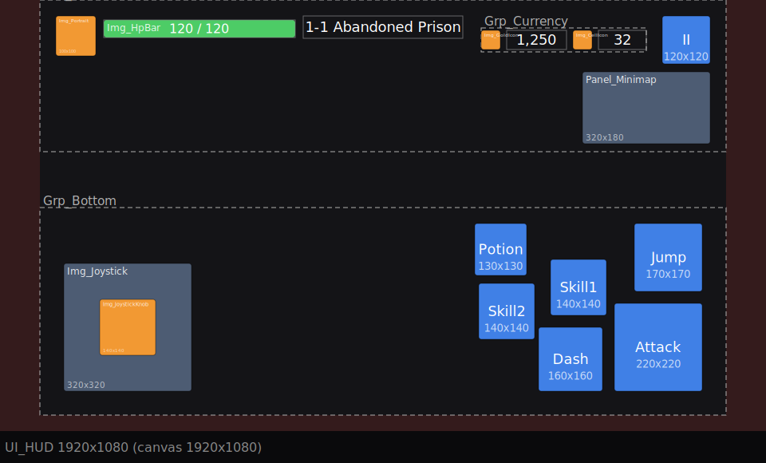
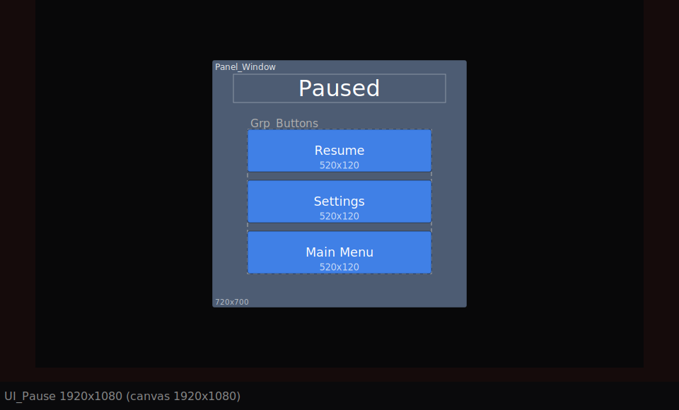

# Unity UI Layout

**English** | [한국어](README.ko.md)

A [Claude](https://claude.ai) skill that turns a game design document into Unity UGUI screens (title, menus, HUD, popups) with a review-first workflow: you approve every step before anything is built.

## Workflow

1. **Concept check** – reads your design doc and summarizes genre, platform, orientation, input, art tone and HUD density. You confirm or correct it.
2. **Screen list** – lists the screens the game needs. You confirm.
3. **Reference games** – posts clickable [Game UI Database](https://www.gameuidatabase.com/) links in chat. You open them and pick.
4. **Layout drawing** – writes a JSON spec per screen and draws it to scale (colored boxes, zones, notch area, other aspect ratios). You approve or request changes.
5. **Sprite matching** – finds matching sprites in your project. Missing ones become color-coded `TEMP_` placeholders.
6. **Prefab generation** – editor scripts build the prefabs under `Assets/UI_Generated/`.
7. **Screenshot check** – renders the prefabs at three resolutions, compares them with the approved layout and fixes problems.
8. **Scene placement** – places the prefabs into the scenes you approve, with a backup first.

## Example

Spec: [`references/spec-example.json`](plugins/unity-ui-layout/skills/unity-ui-layout/references/spec-example.json) (side-scrolling action game HUD, mobile landscape). The red bands are the notch area.



Popup with dim background and a vertical button list: [`spec-example-popup.json`](plugins/unity-ui-layout/skills/unity-ui-layout/references/spec-example-popup.json)



## Install

**Claude Code** (recommended) – two commands in your terminal:

```bash
claude plugin marketplace add balamwind/unity-ui-layout
claude plugin install unity-ui-layout@unity-ui-layout
```

Inside a Claude Code session, the same commands work with a `/` prefix (`/plugin marketplace add ...`). Update later with `/plugin marketplace update unity-ui-layout`.

**Claude.ai / Claude Desktop** – download `unity-ui-layout.skill` from the [latest release](https://github.com/balamwind/unity-ui-layout/releases/latest) and upload it in Claude's skill settings.

**Manual (Claude Code)** – download `unity-ui-layout.skill` from the latest release, then:

```bash
unzip unity-ui-layout.skill -d ~/.claude/skills/
```

## Usage

Ask in plain language, for example:

- `Lay out the UI from docs/GDD.md`
- `Make the HUD for my side-scroller`
- `기획서 보고 UI 배치해줘`

## Requirements

- Unity 6 or newer recommended (verified on Unity 6). Uses UGUI. TextMeshPro is optional: the skill asks whether to enable it or use legacy `Text`.
- Python 3 for the layout drawings (standard library only). Without it, Unity renders a draft image instead.
- Claude Code with access to the project folder, and either the Unity Editor open or the path to the Unity executable for batch mode.

## What gets created

```
Assets/UI_Generated/
├── Editor/         generator, screenshot and scene-placement scripts
├── Scripts/        SafeArea.cs
├── Specs/          one JSON per screen (single source of truth)
├── Prefabs/        generated prefabs (overwritten on regeneration)
├── placement.json  approved scene placement plan
└── Output~/        layouts, screenshots, scene backups, report.txt
```

## Design decisions

- **One spec, two outputs.** The layout drawing and the prefab are built from the same JSON with the same anchor and layout rules, so what you approve is what gets built.
- **Links only for references.** Game UI Database's terms forbid using its content for AI/ML purposes, so the skill never downloads or analyzes its screenshots. It only posts links for you to open.
- **Existing scenes stay untouched until you approve.** Scenes are backed up before saving, YAML is never edited by hand, and existing canvases are reported but never removed.
- **Out of scope:** button events, data binding, animation, screen transitions.

## Status

Verified working on **Unity 6**. Other Unity versions have not been tested yet. If something breaks, please open an issue with your Unity version and the Console log or `Output~/report.txt`.

## License

[MIT](LICENSE)

Not affiliated with or endorsed by Anthropic, Unity Technologies or Game UI Database. Unity and TextMeshPro are trademarks of Unity Technologies.
